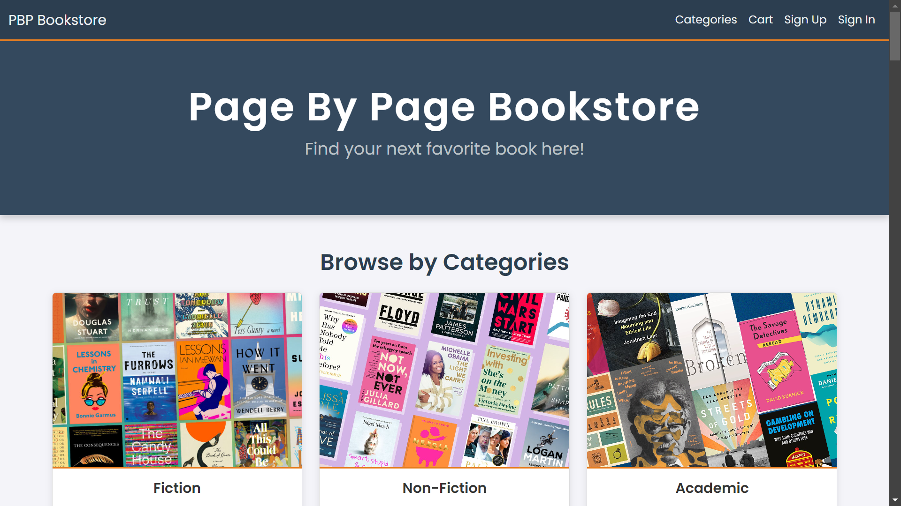
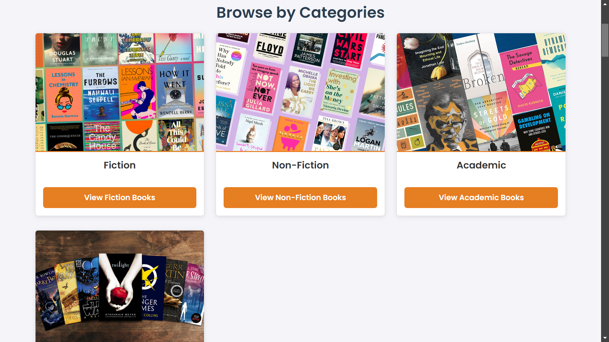
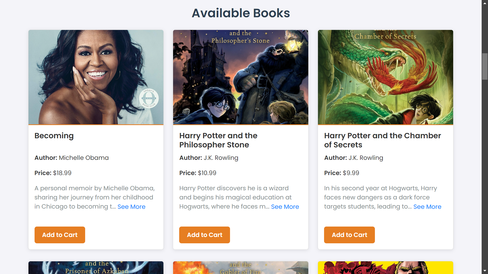
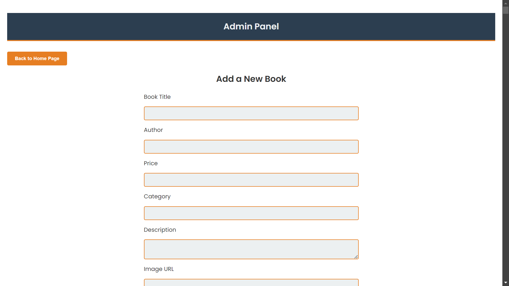
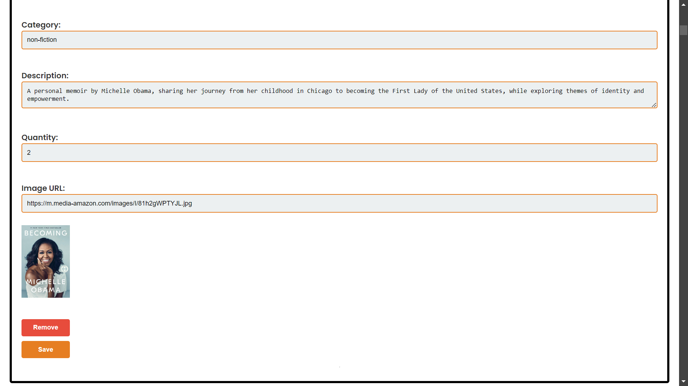
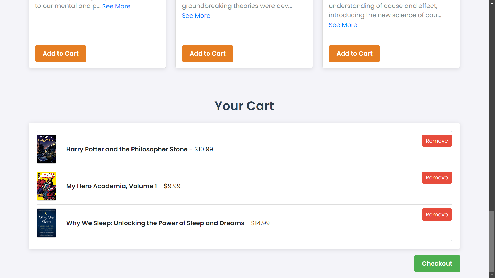
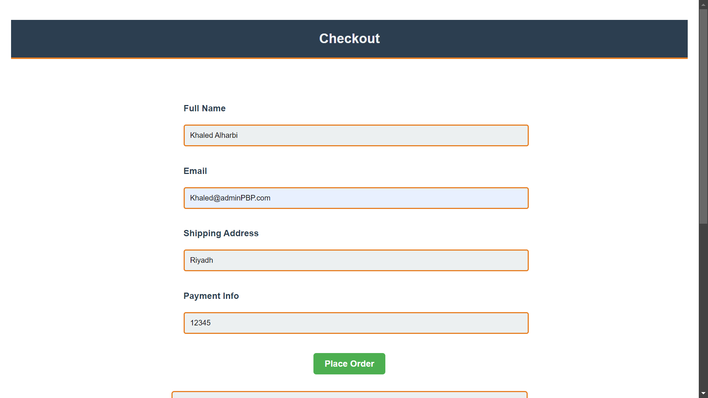
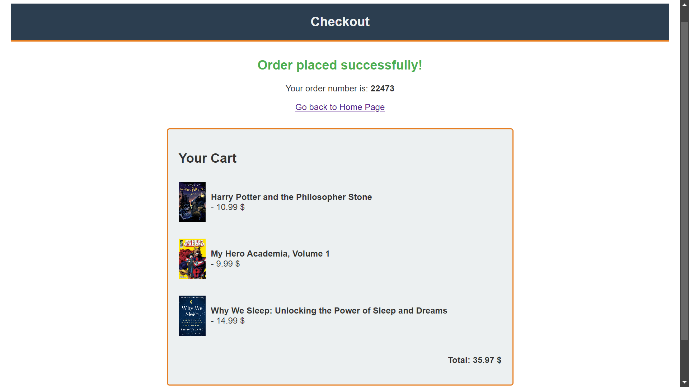

# 📚 Page By Page Online Bookstore  
*By Khaled Alharbi*

---

## 📖 Overview  
**Page By Page Bookstore** is a full stack web application designed to make browsing, searching, and purchasing books simple and enjoyable.  
Users can explore various categories such as Fiction, Non Fiction, Young Adult, and Academic. The shopping cart and checkout flow provide a smooth purchasing experience.

A built in **admin panel** allows bookstore managers to add books, edit information, and maintain accurate stock levels.

---

## 🛒 Features  

### User Experience  
- Browse books by category  
- Dynamic books display directly from the database  
- Add items to the cart  
- Review cart items before checkout  
- Fully responsive design

### Admin Side  
The admin dashboard provides everything needed for online bookstore management:  
- Add new books with full details  
- Edit books information  
- Update stock levels  
- Real time reflection of changes on the user side

---

## 🛠 Tech Stack  
- **Frontend:** HTML, CSS, JavaScript  
- **Backend:** Node.js, Express.js  
- **Database:** MongoDB  
- **Architecture:** RESTful APIs

---

## Setup Notes  
To run the backend correctly, make sure to complete the following steps:

#### 1. Install required software
Before running the backend, make sure you have the following installed:  
a. Node.js  
b. MongoDB Community Server  
c. MongoDB Compass (optional but recommended)  

#### 2. Create a `.env` file in the `backend` folder  
This file must contain your MongoDB connection string.
Use this format as an example:
```
MONGO_URI=mongodb://YOUR_LOCAL_IP:27017/bookstore
```
Replace `YOUR_LOCAL_IP` with your own local address or database URL.

#### 3. Install backend dependencies  
Inside the `backend` folder, run:
```
npm install
```
This will install all required Node modules before running the server.


#### 4. Import sample data such as (books.json) into MongoDB
To load the books or users data into your local database, you need to import the file with MongoDB Compass:
- Open MongoDB Compass
- Create a new database named bookstore
- Create a collection named "books" or "users"
- Click Import Data
- Select the .json file

#### 5. Start the backend server
Inside the `backend` folder, run:
```
node server.js
```
#### 6. Open the project
Once the server is running, simply open the `index.html` file from the project folder in your browser.

---

## 📷 Screenshots  

<p align="center">
  
  
</p>

<p align="center">
  
  
</p>

<p align="center">
  
  
</p>

<p align="center">
  
  
  
</p>

---

## 📜 Credits  
Developed by:   
- **Khaled Alharbi**  


